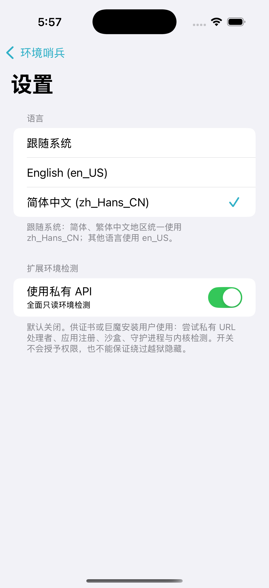

> **本项目由 AI 生成。** 如果不喜欢 AI 生成的软件，请勿使用。检测结果仅供参考，可能存在误报或漏检，无法保证识别所有隐藏环境。

**简体中文（默认）** · [English](README_EN.md)

<div align="center">


# JailPrism

**查看 iPhone 环境，用证据解释每一次判定。**

原生 iOS 环境检测工具，支持越狱类型识别、透明评分与本地报告导出。


[](https://github.com/AkiSenn/JailPrism/actions/workflows/build.yml)

[下载发行版](https://github.com/AkiSenn/JailPrism/releases/latest) · [使用指南](docs/USAGE.md) · [检测原理](docs/DETECTION.md) · [更新记录](CHANGELOG.md) · [问题反馈](https://github.com/AkiSenn/JailPrism/issues)

</div>

## 项目介绍

JailPrism 在设备上检查可见的文件、URL、注入库、进程身份与运行环境，显示疑似越狱类型和对应证据。默认普通模式展示设备信息、评分、疑似环境及商店／注入库名称；专业模式保留全部检测项目与技术注释。

应用使用 UIKit 与 Objective-C 实现，无第三方代码依赖。检测在本地运行，应用不联网；JSON 报告由用户主动分享导出。

## 界面预览

<table>
  <tr>
    <th>普通模式</th>
    <th>专业模式</th>
    <th>语言与检测设置</th>
  </tr>
  <tr>
    <td align="center"></td>
    <td align="center"></td>
    <td align="center"></td>
  </tr>
</table>

截图来自模拟器。普通模式截图使用明确标识的 UI 示例数据展示名称换行，属于界面预览；专业模式的实际模拟器检测项显示「不可判定」。这些截图不代表真机检测结果。

## 主要功能

| 功能 | 内容 |
| :--- | :--- |
| 设备概览 | 具体 iPhone 型号、硬件标识、iOS 版本、构建号、检测时间与耗时 |
| 普通／专业模式 | 普通模式简洁展示结论，专业模式显示全部说明；开关默认关闭 |
| 越狱类型 | 根据证据显示疑似 rootful、rootless、roothide；支持多种类型同时展示 |
| 注入框架 | 覆盖 libhooker、Substitute、MobileSubstrate 与 ElleKit 相关特征 |
| 名称列表 | Cydia／Sileo／Zebra 与已知注入动态库逐行显示，同名证据合并 |
| 巨魔检测 | 安装标记、工具注册与 URL 处理者；苹果放大镜本身不作为巨魔证据 |
| 身份检查 | UID／GID、有效身份与附加用户组异常 |
| 扩展检测 | 私有 API 开关默认关闭，开启后尝试更多只读检测 |
| 双语界面 | 自动选择语言，支持手动切换 English 或简体中文 |
| 报告导出 | JSON 包含检查证据、评分贡献、疑似类型与本次检测配置 |

覆盖的特征包括 Taurine、unc0ver、Dopamine、Dopamine RootHide、Relaxin／RelaxinLite 与 TrollStore。具体检测项与可见性限制见[检测原理](docs/DETECTION.md)。

## 下载与安装

1. 打开 [GitHub Releases 发行版页面](https://github.com/AkiSenn/JailPrism/releases/latest)。
2. 在 **Assets** 中直接下载 `JailPrism-<版本>-unsigned.ipa`。
3. 将 IPA 分享给 TrollStore 安装；同页提供 `SHA256SUMS.txt` 和构建信息供核对。
4. 启动应用自动检测；点击右上角齿轮调整语言与私有 API 设置。

| 项目 | 要求 |
| :--- | :--- |
| 最低系统 | iOS 14.0 |
| 设备架构 | arm64、arm64e |
| 分发文件 | 完全未签名 IPA，无 ad-hoc 签名、描述文件或内嵌 entitlement |
| Bundle ID | `com.akisenn.JailPrism` |
| 安装方式 | TrollStore；其支持的系统范围和安装权限由安装器决定 |

公有仓库的发行版附件可直接下载。也可在 [GitHub Actions](https://github.com/AkiSenn/JailPrism/actions/workflows/build.yml) 中下载成功运行的 `JailPrism-unsigned-iOS14-arm64-arm64e` ZIP：解压后使用 `JailPrism-unsigned.ipa`。Actions 产物保留 30 天，需要登录 GitHub；发行版附件不受该保留期限影响。完整操作说明见[使用指南](docs/USAGE.md)。

## 如何理解结果

| 评级 | 条件 |
| :--- | :--- |
| **完美** | 100 分，且已启用检查没有不可判定项 |
| **疑似** | 71–99 分，或存在不可判定项；因此也可能显示 100 分 |
| **异常环境** | 0–70 分 |

评分与越狱类型分别计算。巨魔证据单独最多扣 15 分，不等同于越狱；安装工具或残留目录也不代表越狱正在运行。未启用的私有检测显示「已跳过」，读取受限的项目显示「不可判定」。

Shadow、Choicy 和其他隐藏机制可能影响检测可见性。「完美」表示当前已启用的可见检查没有证据或错误，不能证明设备绝对未越狱。私有 API 开关不会授予额外权限。详见[评分规则与限制](docs/DETECTION.md#评分机制)。

## 开发与文档

| 文档 | 内容 |
| :--- | :--- |
| [使用指南](docs/USAGE.md) | 安装、语言、私有模式、筛选与报告导出 |
| [检测原理](docs/DETECTION.md) | 环境特征、证据分类、评分机制与参考来源 |
| [构建说明](docs/BUILDING.md) | Windows 工程生成、GitHub 云编译、macOS 构建与验证 |
| [贡献与反馈](CONTRIBUTING.md) | 复现信息、漏检反馈与代码修改约定 |
| [更新记录](CHANGELOG.md) | 各版本的功能变化 |

在 macOS 上构建：

```bash
bash scripts/build.sh
```

Windows 用户可通过 GitHub Actions 编译，无需在本机安装 Xcode。CI 会验证评分与设置回归、语言资源、双架构未签名包，以及模拟器中的语言切换和模式开关；真机准确率需要安装实测。

## 致谢


- [Codex](https://github.com/openai/codex)
- GPT-6.1 Sol

OpenAI 图标归 OpenAI 所有，取自其[官方 GitHub 组织](https://github.com/openai)，用于开发工具致谢，不代表官方背书。JailPrism 运行时不调用 AI 服务。
