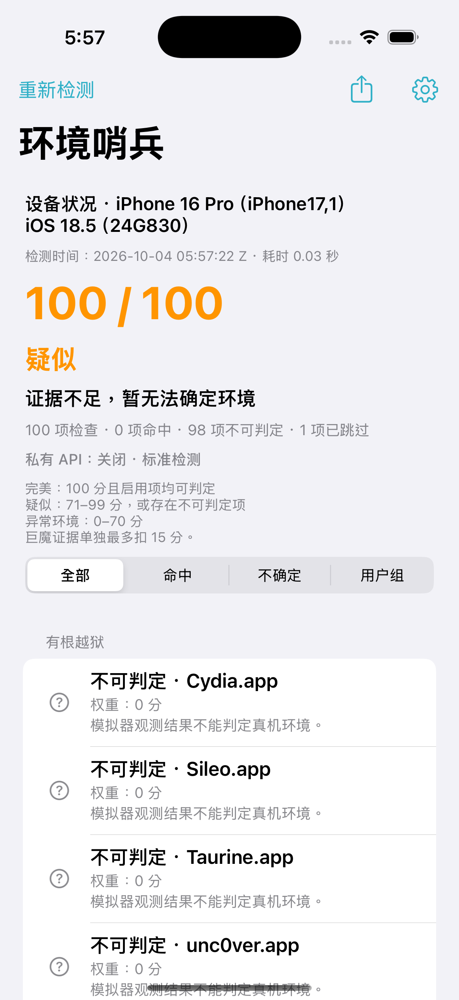
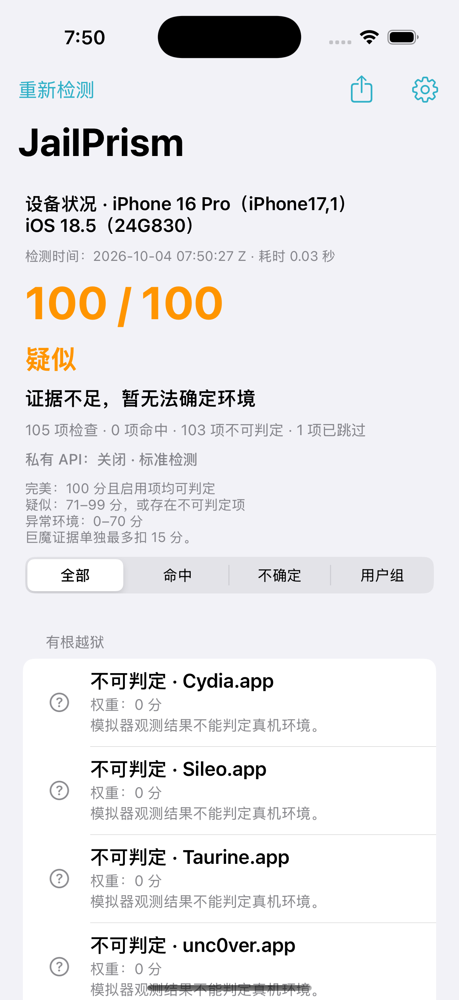
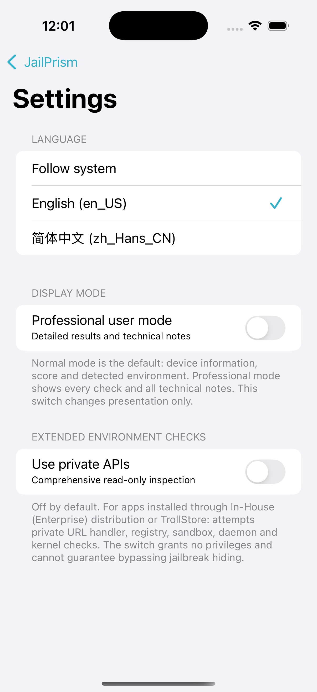

> **This project was generated by AI.** If you prefer not to use AI-generated software, please do not use it. Results are for reference and may include false positives or missed detections. The app cannot guarantee detection of every hidden environment.

[简体中文（默认）](README.md) · **English**

<div align="center">


# JailPrism

**Inspect your iPhone environment and see the evidence behind each result.**

A native iOS environment inspector with jailbreak classification, transparent scoring and local report export.


[](https://github.com/AkiSenn/JailPrism/actions/workflows/build.yml)

[Download release](https://github.com/AkiSenn/JailPrism/releases/latest) · [User guide](docs/en/USAGE.md) · [Detection methods](docs/en/DETECTION.md) · [Changelog](docs/en/CHANGELOG.md) · [Report an issue](https://github.com/AkiSenn/JailPrism/issues)

</div>

## Overview

JailPrism checks visible files, URL handlers, injected libraries, process identity and runtime properties. It reports suspected jailbreak families and the supporting evidence. Normal mode is the default and shows device information, a score, suspected environments and detected store or library names. Professional mode shows every check and its technical notes.

The app uses UIKit and Objective-C without third-party code dependencies. Detection runs locally; the app does not connect to the network. JSON reports leave the app only when you choose to share them.

## Screenshots

<table>
  <tr>
    <th>Normal mode</th>
    <th>Professional mode</th>
    <th>Language and detection settings</th>
  </tr>
  <tr>
    <td align="center"></td>
    <td align="center"></td>
    <td align="center"></td>
  </tr>
</table>

These simulator screenshots show the main pages in Chinese and the settings page in English. The normal-mode screenshot uses explicitly marked UI fixture data to illustrate multiline names. The professional-mode screenshot uses actual simulator results, where physical-device checks are unknown. Screenshots do not demonstrate detection accuracy on a real device.

## Features

| Feature | Details |
| :--- | :--- |
| Device overview | iPhone model, hardware identifier, iOS version, build number, detection time and duration |
| Normal and professional modes | Concise results by default; enable professional mode to see all technical notes |
| Jailbreak classification | Suspected rootful, rootless or roothide; multiple families can be shown |
| Injection frameworks | libhooker, Substitute, MobileSubstrate and ElleKit indicators |
| Name lists | Cydia, Sileo, Zebra and known injected libraries, shown on separate lines with duplicate names merged |
| TrollStore detection | Installation markers, registered tools and actual URL handlers; Apple's Magnifier alone is not evidence |
| Identity checks | UID, GID, effective identity and supplementary group anomalies |
| Extended inspection | Optional private API checks, disabled by default |
| Two interface languages | Automatic selection or manual English and Simplified Chinese selection |
| Report export | JSON containing evidence, scoring contributions, suspected types and scan configuration |

Indicators cover Taurine, unc0ver, Dopamine, Dopamine RootHide, Relaxin/RelaxinLite and TrollStore. See [detection methods](docs/en/DETECTION.md) for the evidence and visibility limits.

## Download and install

1. Open the [latest GitHub Release](https://github.com/AkiSenn/JailPrism/releases/latest).
2. Download `JailPrism-<version>-unsigned.ipa` directly from **Assets**.
3. Share the IPA with TrollStore to install it. `SHA256SUMS.txt` and build metadata are available on the same page.
4. Launch the app to scan. Use the gear button to change language, professional mode or private API settings.

| Item | Requirement |
| :--- | :--- |
| Minimum system | iOS 14.0 |
| Architectures | arm64 and arm64e |
| Distribution | Completely unsigned IPA: no ad-hoc signature, provisioning profile or embedded entitlements |
| Bundle ID | `com.akisenn.JailPrism` |
| Installer | TrollStore; installation support and runtime privileges depend on the installer |

Public release assets can be downloaded directly. Development builds are also available in [GitHub Actions](https://github.com/AkiSenn/JailPrism/actions/workflows/build.yml): choose a successful run, download `JailPrism-unsigned-iOS14-arm64-arm64e`, then extract `JailPrism-unsigned.ipa`. Actions artifacts require a GitHub login and are retained for 30 days; release assets are not subject to that retention period. See the [user guide](docs/en/USAGE.md).

## Understanding results

| Rating | Condition |
| :--- | :--- |
| **Perfect** | Score 100, with no unknown enabled checks |
| **Suspected** | Score 71–99, or any unknown checks; a score of 100 can therefore be suspected |
| **Abnormal environment** | Score 0–70 |

Scoring and jailbreak classification are calculated separately. TrollStore evidence alone deducts at most 15 points and does not establish a jailbreak. Installed tools or leftover directories do not establish that a jailbreak is currently active. Disabled private checks are skipped; restricted or failed queries are unknown.

Shadow, Choicy and other hiding mechanisms can reduce visibility. Perfect means that the currently enabled, visible checks found no evidence or errors; it does not prove the device has never been jailbroken. The private API switch grants no additional privileges. See [scoring and limitations](docs/en/DETECTION.md#scoring).

## Development and documentation

| Document | Contents |
| :--- | :--- |
| [User guide](docs/en/USAGE.md) | Installation, languages, display modes, private APIs and report export |
| [Detection methods](docs/en/DETECTION.md) | Indicators, classification, scoring, limitations and sources |
| [Build guide](docs/en/BUILDING.md) | Windows project generation, cloud builds, macOS builds and release assets |
| [Contributing](docs/en/CONTRIBUTING.md) | Reproduction details, missed detections and code changes |
| [Changelog](docs/en/CHANGELOG.md) | Changes by version |

On macOS:

```bash
bash scripts/build.sh
```

Windows users can build with GitHub Actions without installing Xcode locally. CI validates scoring and settings regressions, language resources, the unsigned dual-architecture package and simulator language/mode cases. Detection accuracy requires real-device testing.

## Acknowledgments


- [Codex](https://github.com/openai/codex)
- GPT-6.1 Sol

The OpenAI icon belongs to OpenAI and comes from its [official GitHub organization](https://github.com/openai). It is used to acknowledge development tools and does not imply endorsement. JailPrism does not call AI services at runtime. These credits appear in the documentation only.
